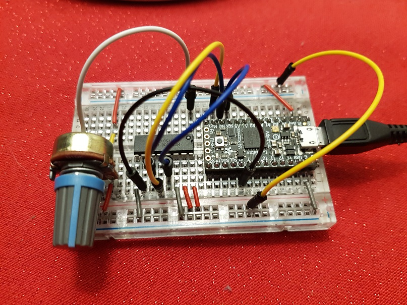
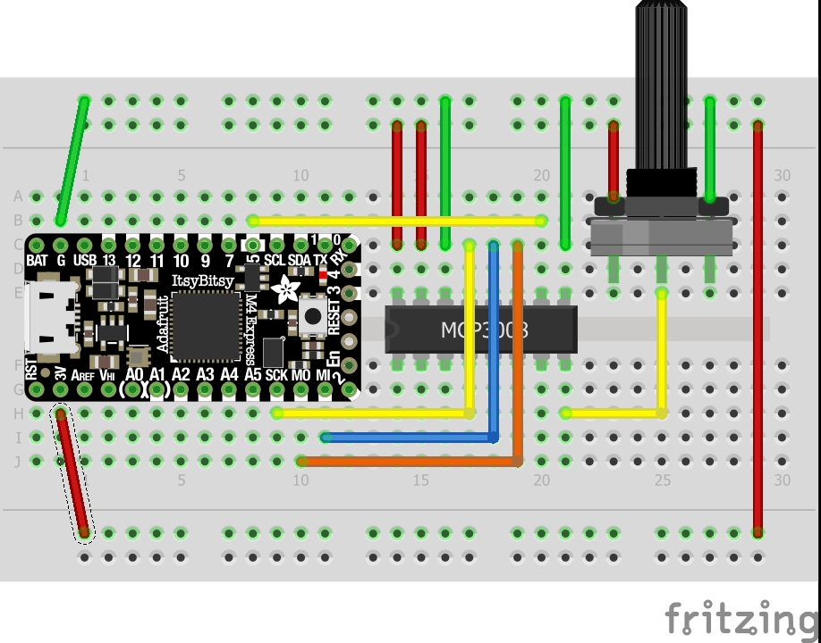

# MCP3008 ADC on CircuitPython
Example of connecting MCP3008 ADC chip using CircuitPython.  The MCP3008 is an 8 channel 10 bit analog to digital converter and useful for Rasp Pi which does not have analog input pins.  This circuit connects a potentiometer to one of channels so you can see the value changes in real time.

Potentially you could run this code (i.e. CircuitPython) on a raspberry pi if you added imported the adafruit_Blinka library.

